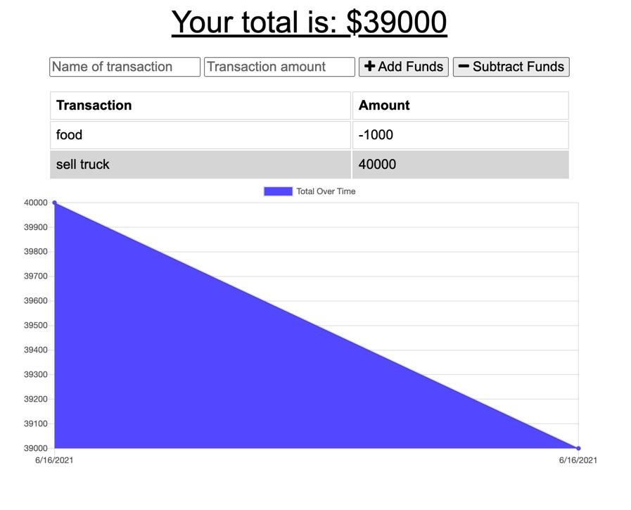

# Budget-Tracker-Progressive

[Link to deployed site](https://lit-badlands-23728.herokuapp.com/)

## Description

As a an avid traveller, it is extremely important to keep track of all funds. From the busy cities where connection is great, to the sticks where there isint a cell tower in sight. This app will get all of your budgeting needs taken care of no matter the location. Even offline, entries can be made when needed, all the data that was posted offline will not be ignored or forgotten. When an internet connection is reestablished, all of the data posted offline will be created once an internet connection is reestablished.

## Usage

This app is very simple to use. Whem the user recieves or spends money, they simply have to add a description of what the transaction is then click the add funds or subtract funds. The app will take care of the rest, Logging the funds and displaying on a chart below. This app has access to all functionality on or offline.

## Features

- Pregressive web app
  This app uses pregressive web app technology to cache data to allow user to still operate the app offline, the manifest allows the user to download the application to a version that looks native to the device by relaying details to display properly when downloaded.

- Data caching
- IndexedDB

## Credits

- Class activity refrences
